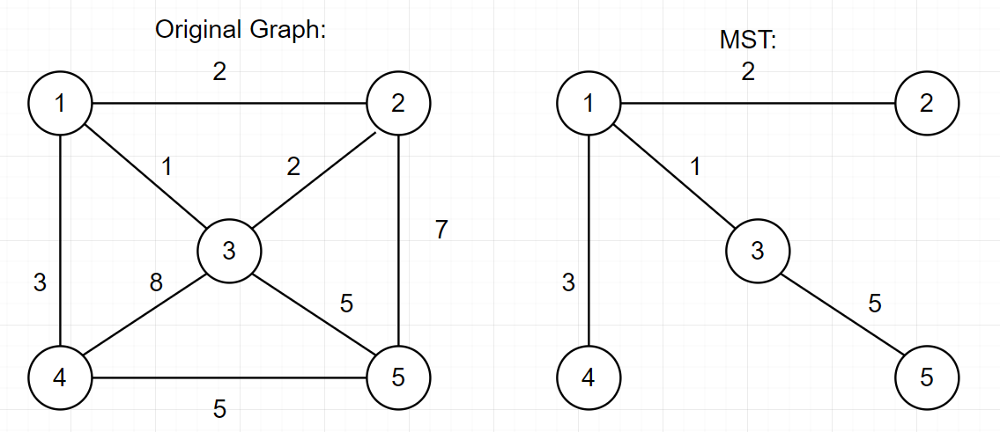

# Exercise 3

### Explain what a minimum spanning tree is, with an example (a simple graph with 5 to 10 nodes is sufficient)
A spanning tree is a tree that contains every vertex of a connected graph. A minimum spanning tree is a type of spanning tree that is defined by connecting all nodes with the minimum cost. The cost is determined by the sum of all edge weights. 
Here is an example of a minimum spanning tree with a root of 1:

